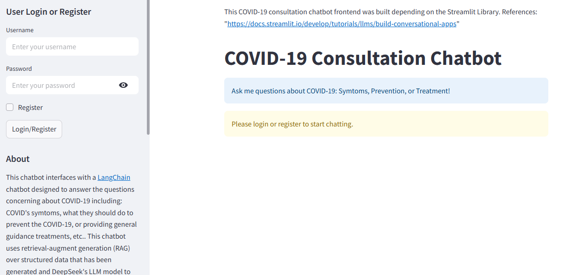

# 🩺 COVID-19 Consultation chatbot

**_An AI-powered conversational chatbot for COVID-19 consultation, built using **Large language models (LLMs)**, **vector search**, and **contextual memory**._**
---
## 🎯 Objective
1. **Consulting users about COVID-19 symptoms, prevention, and treatment** in multiple languages.
2. **Maintaining memory** of prior conversations and **user profiles** to offer more personalized responses.
3. **Recognizing relationships** between the user and other individuals (e.g., family members, colleagues) and offering contextual guidance based on these connections.

## 🧠 Key Technologies

| Component              | Technology Used                   |
|------------------------|------------------------------------|
| 🧠 Large Language Model | DeepSeek-r1-0528-qwen3-8b via free OpenRouterAPI provider   |
| 📚 Vector Search Engine | all-MiniLM-L6-v2 model for embedding text and Faiss for vector search  |
| 💬 Chat Interface        | Streamlit                         |
| 🌐 API Backend          | FastAPI and GraphDB (Neo4J) to store chat history, user profile                         |
| 🧵 Session Management   | Streamlit `st.session_state`       |
| 🐳 Deployment           | Docker & Docker Compose           |

## 📘 Description

This chatbot system integrates several AI components to enable intelligent, personalized consultations about COVID-19. Below is an overview of how key functionalities are implemented:

### 🔍 1. Vector Search Engine

- The chatbot uses **FAISS** (Facebook AI Similarity Search) to perform fast vector-based retrieval over a knowledge base of COVID-19 domain data.
- The texts are embedded using the **`all-MiniLM-L6-v2`** model from `sentence-transformers`, a compact yet powerful transformer that balances performance and speed.
- The indexing process will load the data from Json file with structure {'user':...., 'assistant':...}. The user query and assistant's response will combine into the text block. Then, This combined text is passed through all-MiniLM-L6-v2 to generate a vector embedding. The embedding is stored and indexed in FAISS, enabling fast similarity search during chat interactions. **All the index and metadata file are stored in the `chatbot_api/src/Output`. We can update this by deleting this Output folder, Adding the Json file to the `chatbot_api/src/data`, and then, will automatically create the vector database in the first**. 
- When a user query is submitted:
  - It’s converted into a vector using `all-MiniLM-L6-v2`
  - FAISS is queried to return top relevant context passages
  - These passages are included in the prompt sent to the LLM for informed, grounded responses

### 🧠 2. Response Generation

- The chatbot uses a **Large Language Model (LLM)** (i.e., DeepSeek-r1-0528-qwen3-8) via free OpenRouterAPI provider (https://openrouter.ai/models) to generate fluent, human-like responses.
- Prompts are constructed based on:
  - System Prompt: Describe the task of this chatbot and define how model generate the response and use the external information. 
  - Retrieved knowledge from vector search
  - User Input
- The LLM is called via API in the backend (FastAPI) to return contextual and domain-relevant answers.
- **On-going Improvement**: Injecting the current and past history chat message into the prompt to enhance the memory and context of LLM model to accurately generate response for lack of specific questions (e.g., what about my father..) 

### 🗃 3. Information Extraction

- The user's input is parsed using LLM-assisted parsing through prompting to extract relevant information, such as:
  - Symptoms mentioned
  - Health Conditions
  - Mentioned individuals (e.g., family members, colleagues)
- This extracted information is return in the Json format and, then store in the Graph database through Neo4J.
- **On-going Improvement**:
  - Extracted data is stored in memory to support future turns in the conversation.
  - In this design, the extracted data is tied to the response generation process --> Increasing the user-perceived latency --> In the future, we will decoupling these two processes. 


### 👤 4. User Profile and Context Management

- Each user has an associated **context memory** that includes:
  - Basic profile (e.g., age, existing conditions)
  - Conversation history
  - Related individuals and their attributes
- All of extracted information is extracted in the above **Information Extraction** with Json format. For example:
  {
  "name": "John",
  "age": 42,
  "symptoms": ["sore throat", "fever"],
  "health_conditions": [],
  "family_members": [
    {{
      "relation": "father",
      "age": null
      "condition": ["diabetes"]
    }}
  ]
}).
- And, from these Jsons, For longer retention, user profiles can be stored in a database Neo4j for relationships as follows:
  - (User)-[:HAS_SYMPTOM]->(Symptom)
  - (User)-[:RELATED_TO]->(FamilyMember)
  - (FamilyMember)-[:HAS_CONDITION]->(Condition)
  - (User) -[:SENT]-> (Message)
- Session state is tracked using `st.session_state` in Streamlit for temporary memory.
## 🚀 Running the Project

### 📦 Requirements

- [Docker Desktop](https://www.docker.com/products/docker-desktop)
- Docker Compose (comes with Docker Desktop)
  
### 🔧 Run the Full Stack In Docker 

In the project root directory:

```bash
docker compose up --build
```


### 🧪 Run the App Locally (Without Docker)


If you prefer to run the backend and frontend manually:


#### 1. Update `.env` Configuration


Modify the `.env` file with the required API keys and settings.


#### 2. Run the Backend

```bash
cd chatbot_api/src
uvicorn main:app --reload
```

The backend will be available at: [http://localhost:8000](http://127.0.0.1:8000)

#### 3. Run the Frontend

In a new terminal:

```bash
cd chatbot_frontend/src
streamlit run main.py
```

The frontend UI will be available at: [http://localhost:8501](http://localhost:8501)

## 🙋‍♂️ Using the App: Login & Registration

After launching the app (via Docker or local execution), access it in your browser. Before chatting, you must log in:

### 🆕 New User (Register):
1. Enter your **Username** and **Password**.
2. ✅ Check the box labeled **"Register"**.
3. Click **Submit** to create your account.

> This will register your profile and initialize a new session with memory.

### 🔐 Existing User (Login):
1. Enter your **Username** and **Password**.
2. ❌ Leave the **"Register"** box **unchecked**.
3. Click **Submit** to log in with your existing account.

> After that, starting chat. 


 
